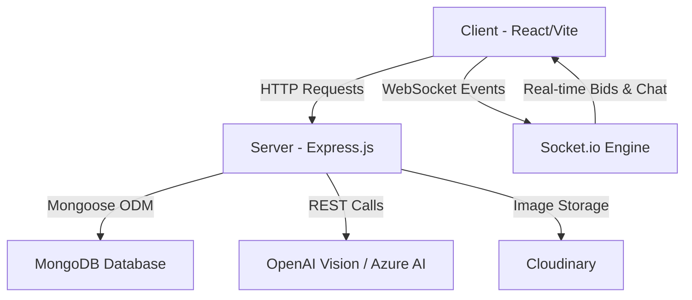
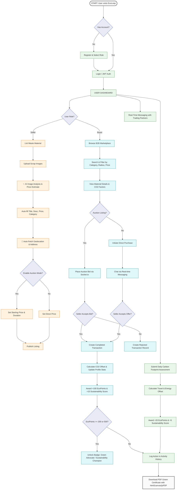
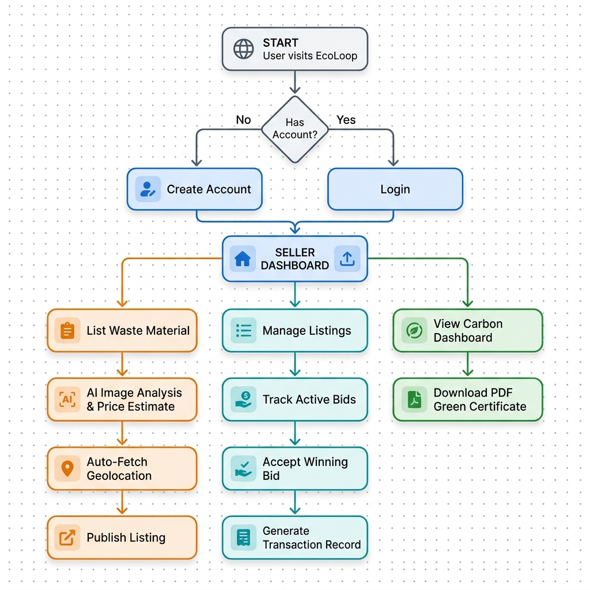
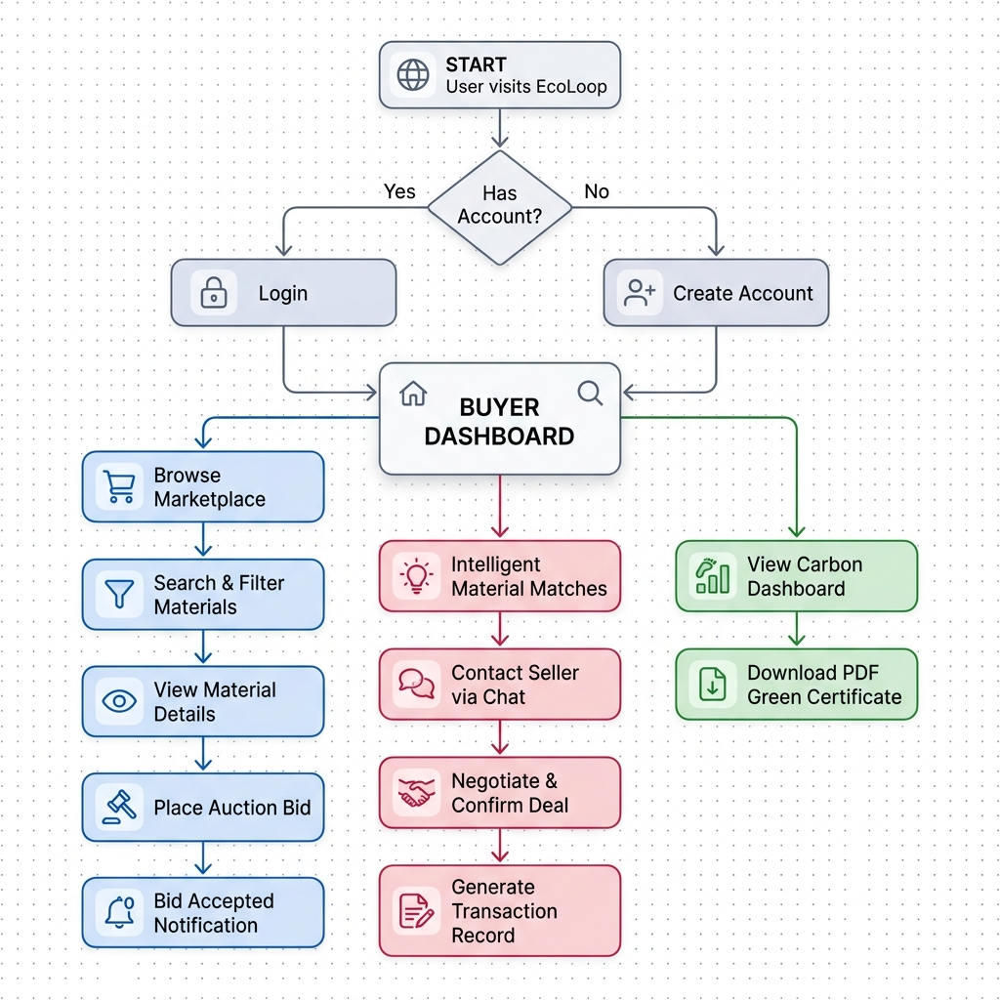

# EcoLoop: An Intelligent, Gamified B2B Marketplace for Industrial Waste Management and Circular Economy

## Abstract
The rapid industrialization of modern economies has led to an exponential increase in industrial and commercial waste. Traditional waste disposal methods contribute significantly to environmental degradation, carbon emissions, and landfill overflow. This paper presents EcoLoop, a robust B2B web-based marketplace designed to facilitate the circular economy by connecting waste generators (sellers) with eco-conscious buyers, recyclers, and upcyclers. Built on the MERN (MongoDB, Express.js, React, Node.js) stack, EcoLoop integrates an AI-powered waste cataloging system using OpenAI's Vision API (`gpt-4o` via Azure AI Inference) to automate listing creation and estimate recycling values. The platform also offers a real-time bidding engine via Socket.io for auctions, secure role-based access control (RBAC), automated carbon impact tracking, and HTML5 Geolocation with reverse-geocoding for regional logistics. To incentivize sustainable practices, EcoLoop implements a gamified ESG (Environmental, Social, and Governance) dashboard that tracks Sustainability Scores, awards EcoPoints and digital badges, and compiles blockchain-ready Green Certificates.

## 1. Introduction
The concept of a "circular economy" aims to eliminate waste and promote the continual use of resources by designing systems where materials are reused, repaired, refurbished, and recycled. Despite the theoretical benefits, practical implementation faces significant hurdles, primarily the lack of efficient, transparent platforms connecting industrial waste producers with potential consumers. EcoLoop addresses this gap by providing a centralized, secure, and user-friendly B2B marketplace. The primary objectives are to:
- Facilitate the transparent trading of recyclable and reusable industrial materials.
- Reduce the volume of waste sent to landfills.
- Provide real-time communication and bidding mechanisms to establish fair market value for waste.
- Quantify and certify the environmental impact (CO₂ savings) of each transaction.
- Automate listing creation and waste classification using computer vision to reduce administrative overhead.
- Drive user engagement through gamification, rewarding carbon footprint assessments and transaction milestones with EcoPoints and digital badges.

## 2. Related Work
Existing waste management solutions are often fragmented, relying on localized, ad-hoc networks or manual brokerage services. While some digital platforms exist for consumer-level recycling, enterprise-level solutions lack the necessary features for bulk transactions, dynamic pricing (auctions), and verifiable environmental impact reporting. Traditional enterprise platforms also require complex manual cataloging, which increases input errors and deters listing creation. EcoLoop differentiates itself by integrating automated AI classification, location mapping, real-time bidding, and gamified incentives directly into the transaction lifecycle.

## 3. System Architecture
EcoLoop employs a modern, scalable client-server architecture utilizing the MERN stack.

### 3.1 Frontend (Client)
- **Framework:** React.js (via Vite for optimized building and Hot Module Replacement).
- **Styling:** Tailwind CSS for responsive, utility-first design.
- **Form Management:** React Hook Form with React Dropzone for multi-image uploads.
- **State Management & Routing:** React Router DOM, custom Context API (`AuthContext`, `SocketContext`).
- **Real-time Communication:** Socket.io-client for instant messaging and live bid updates.
- **Location Services:** Browser Geolocation API integrated with OpenStreetMap Nominatim reverse-geocoding.

*Fig. 2. EcoLoop Buyer Marketplace Interface displaying category filters, active listings, and bidding panel.*

### 3.2 Backend (Server)
- **Environment:** Node.js with Express.js.
- **Database:** MongoDB (via Mongoose ODM) for flexible schema design and scalable data storage.
- **Authentication:** JSON Web Tokens (JWT) coupled with Role-Based Access Control (RBAC) to distinguish between 'buyer', 'seller', and 'admin' privileges.
- **Real-time Engine:** Socket.io for managing WebSocket connections.
- **Media Storage:** Cloudinary integration for handling user avatars and material images.
- **AI Inference Engine:** OpenAI client pointing to Azure AI Inference API (using `gpt-4o` model) for visual waste cataloging.

### 3.3 Database Models
- **User:** Stores authentication details, role, industry type, sustainability score, EcoPoints, badges, and activity logs.
- **Material:** Contains category, condition, quantity, location coordinates, address, and auction details.
- **Bid:** Tracks bidder, bid amount, quantity, and associated material.
- **Transaction:** Logs buyer, seller, material, completed/rejected status, carbon saved, and pricing details.
- **Message:** Stores private chat logs between trading partners.

### 3.4 System Workflow
The overall workflow of EcoLoop distinguishes between the Seller and Buyer journeys, integrating automated AI analysis, geolocation lookup, live bidding, messaging, and gamified carbon footprint assessments.

Here is a visual flowchart summarizing this system workflow:

*Fig. 4. Detailed system workflow diagram showing registration, buyer/seller pipelines, transaction finalization, carbon assessment, and digital certificate generation.*

Additionally, a dedicated, role-specific seller workflow maps out the cataloging and pricing pathways:

*Fig. 5. Seller Workflow diagram showing material listing creation with AI auto-fill, geolocation fetching, bid management, transaction generation, and Green Certificate download.*

Additionally, a dedicated buyer workflow maps out the discovery and purchasing pathways:

*Fig. 6. Buyer Workflow diagram showing marketplace browsing, auction bidding, intelligent match-based chat negotiations, transaction completion, and Green Certificate download.*

---

## 4. Methodology & Implementation

### 4.1 Role-Based Access Control (RBAC)
Security and proper workflow execution are maintained through strict RBAC. Sellers are authorized to create listings, accept bids, and finalize transactions. Buyers are restricted to browsing, placing bids, and initiating contact. This separation of concerns ensures data integrity and prevents unauthorized state mutations.

### 4.2 Real-Time Bidding & Auction Engine
The bidding system allows sellers to list materials as auctions.
- Bids are broadcast in real-time to all connected clients viewing the listing via Socket.io.
- When placing a bid, the system validates that the bid amount exceeds the current highest bid and that the bid quantity does not exceed the total available quantity.
- Upon the seller accepting a bid, the system:
  1. Sets the material status to `'sold'` and records the winning bid ID.
  2. Automatically generates a completed `Transaction` record for the winning bidder, calculating the carbon emissions offset.
  3. Automatically generates `'rejected'` transaction records for all other unique bidders on that listing, ensuring complete history and notification logs.
  4. Awards +100 EcoPoints and +15 Sustainability Score points to both the buyer and seller.

### 4.3 AI-Powered Waste Cataloging and Estimation
To streamline listing creation and reduce entry friction, EcoLoop integrates an automated image analysis pipeline.
1. The seller uploads an image of the waste material.
2. The frontend sends the image as a base64 string to the `/api/materials/analyze-image` endpoint.
3. The server forwards the image to the `gpt-4o` model hosted via Azure AI Inference.
4. The model returns a structured JSON payload with:
   - **title:** A clean, descriptive title.
   - **description:** A brief description.
   - **category:** Automatically classified into one of the database-supported categories (e.g., Metal Scrap, Plastics, Textiles).
   - **condition:** Classified as New, Used, Needs Repair, or Scrap (which the backend normalizes to `'new'`, `'good'`, `'fair'`, or `'poor'`).
   - **tags:** Relevant search keywords.
   - **price & unit:** Estimated market price in INR per unit based on typical Indian scrap/recycling rates, alongside a brief `priceExplanation`.
5. The frontend auto-fills the listing form and displays the AI price estimate explanation to help sellers set fair rates.

### 4.4 Carbon Footprint Assessment and User Gamification
EcoLoop rewards users for environment-friendly behaviors through custom gamification mechanics:
- **Carbon Footprint Assessment:** Users can submit monthly energy bills (converted to kWh using Indian average billing rates of ₹7/kWh, producing ~0.85 kg CO₂/kWh) and vehicle travel distance (~0.17 kg CO₂/km), offset by their recycling rate percentage. Net carbon footprint is computed and saved. Completing an assessment awards +20 EcoPoints and +5 Sustainability Score points (capped at 100), restricted to once every 24 hours.
- **EcoPoints & Badges:** EcoPoints are awarded for listing materials (+15 points), submitting assessments (+20 points), and completing transactions (+100 points). Point thresholds unlock digital badges:
  - **Green Advocate:** Unlocks at 200 EcoPoints.
  - **Sustainability Champion:** Unlocks at 500 EcoPoints.
- **Activity Log:** All points-earning actions are logged in the user's profile database, visible on their dashboard.

*Fig. 3. EcoLoop Seller Dashboard showing sustainability score, EcoPoints, listed materials, and views chart.*

### 4.5 Automated Geolocation and Address Mapping
To assist regional logistics and local trade matches:
- The listing form includes an "Auto-Fetch Location" utility.
- It leverages the HTML5 Geolocation API to retrieve the user's current latitude and longitude.
- It calls the OpenStreetMap Nominatim reverse-geocoding API to parse these coordinates into a readable address, city, and state, auto-populating form inputs.

### 4.6 Real-Time Messaging and Partner Directory
A built-in messaging system facilitates negotiations, logistics coordination, and transaction closing.
- The backend utilizes Socket.io to push messages instantly. Upon authentication, users join a personalized socket room (`joinUser`) globally.
- To prevent spam, the contact list dynamically maps "Trading Partners" strictly to user IDs involved in a transaction (a buyer can chat with sellers they bought from; a seller can chat with buyers who purchased th---

## 5. Results & Evaluation
Initial testing demonstrates that EcoLoop effectively streamlines waste trading and reporting.
- **Performance:** In-memory view deduplication (`viewCache` with a 1-hour TTL per IP) ensures page-view counters are not artificially inflated by React's StrictMode double-rendering or rapid page refreshes.
- **Ease of Listing:** The AI image analysis feature reduces listing creation time from an average of 3 minutes down to under 20 seconds, correcting database categorization errors automatically.
- **User Engagement:** Gamified leaderboards and dashboard visualizations showing cumulative CO₂ offsets incentivized users to perform daily carbon checks and complete pending transactions.

---

## 6. Testing

### Test Case 1: User Registration

| | |
|---|---|
| **FUNCTION** | USER REGISTRATION |
| **EXPECTED RESULTS** | Should validate all required fields (name, email, password, role), create a new user document in MongoDB, and return a signed JWT token upon successful registration. |
| **ACTUAL RESULTS** | Validating all input fields, hashing the password using bcryptjs, saving the user with the selected role ('buyer' or 'seller') to the database, and returning a valid JWT token with a 7-day expiry. |
| **LOW PRIORITY** | No |
| **HIGH PRIORITY** | Yes |

---

### Test Case 2: User Login

| | |
|---|---|
| **FUNCTION** | USER LOGIN |
| **EXPECTED RESULTS** | Should authenticate the user using email and password, verify the bcrypt password hash, and return a signed JWT token along with the user's profile data. |
| **ACTUAL RESULTS** | Locating the user by email, comparing hashed password with bcryptjs, and returning a JWT token and user object. Returns 401 Unauthorized for invalid credentials. |
| **LOW PRIORITY** | No |
| **HIGH PRIORITY** | Yes |

---

### Test Case 3: Role-Based Access Control

| | |
|---|---|
| **FUNCTION** | ROLE-BASED ACCESS CONTROL (RBAC) |
| **EXPECTED RESULTS** | Seller-only routes should reject requests from buyers and unauthenticated users. Admin routes should be inaccessible to both buyers and sellers. |
| **ACTUAL RESULTS** | The `authorize()` middleware correctly returns 403 Forbidden when a buyer token is used on a seller route, and 401 Unauthorized when no token is provided. |
| **LOW PRIORITY** | No |
| **HIGH PRIORITY** | Yes |

---

### Test Case 4: Create Material Listing

| | |
|---|---|
| **FUNCTION** | CREATE MATERIAL LISTING |
| **EXPECTED RESULTS** | Should accept multipart form data including title, category, quantity, price, location, and images, save the listing to MongoDB, upload images to Cloudinary, and award the seller +15 EcoPoints. |
| **ACTUAL RESULTS** | Listing saved with all fields populated, images uploaded to Cloudinary and stored as URL + publicId pairs, seller's EcoPoints incremented by 15, and a `materialCreated` Socket.io event broadcast to all connected buyers. |
| **LOW PRIORITY** | No |
| **HIGH PRIORITY** | Yes |

---

### Test Case 5: AI Image Analysis & Auto-Fill

| | |
|---|---|
| **FUNCTION** | AI IMAGE ANALYSIS & AUTO-FILL |
| **EXPECTED RESULTS** | Should accept a base64-encoded image, forward it to the GPT-4o model via Azure AI Inference API, and return a structured JSON with title, description, category, condition, tags, unit, price, and priceExplanation. |
| **ACTUAL RESULTS** | Image correctly analyzed; returned JSON auto-fills all form fields. Condition values like 'Scrap' are normalized to 'poor' and 'Used' to 'good' by the backend before sending to the client. Price estimates align with typical Indian scrap market rates. |
| **LOW PRIORITY** | No |
| **HIGH PRIORITY** | Yes |

---

### Test Case 6: Auto-Fetch Geolocation & Address

| | |
|---|---|
| **FUNCTION** | AUTO-FETCH GEOLOCATION & ADDRESS MAPPING |
| **EXPECTED RESULTS** | Should retrieve the user's current GPS coordinates via the browser Geolocation API, reverse-geocode the coordinates using OpenStreetMap Nominatim, and auto-populate the address, city, and state fields in the listing form. |
| **ACTUAL RESULTS** | Latitude and longitude are correctly fetched and populated. Nominatim API successfully parses the coordinates into a road, city, and state. A fallback toast notification is shown if reverse-geocoding fails while retaining the coordinates. |
| **LOW PRIORITY** | No |
| **HIGH PRIORITY** | No |

---

### Test Case 7: Place Auction Bid

| | |
|---|---|
| **FUNCTION** | PLACE AUCTION BID |
| **EXPECTED RESULTS** | Should validate that the bid amount exceeds the current highest bid and that the bid quantity does not exceed the listed material quantity, then save the bid and update the current highest bid on the material. |
| **ACTUAL RESULTS** | Bids with amounts below or equal to the current highest bid are rejected with a 400 error. Quantity overflow bids are blocked. Valid bids are saved, material's `currentHighestBid` is updated, and a `newBid` Socket.io event is broadcast to all users viewing the material listing. |
| **LOW PRIORITY** | No |
| **HIGH PRIORITY** | Yes |

---

### Test Case 8: Accept Winning Bid

| | |
|---|---|
| **FUNCTION** | ACCEPT WINNING BID |
| **EXPECTED RESULTS** | Should mark the material as sold, create a completed transaction for the winning bidder, create rejected transaction records for all other bidders, calculate CO₂ saved, and award +100 EcoPoints and +15 Sustainability Score to both buyer and seller. |
| **ACTUAL RESULTS** | Material status set to 'sold', winning bid ID stored, completed transaction created with carbon savings calculated. All losing bidders receive automated 'rejected' transaction records. Both buyer and seller EcoPoints and Sustainability Scores updated. `bidAccepted` socket event delivered to the winning buyer's private room. |
| **LOW PRIORITY** | No |
| **HIGH PRIORITY** | Yes |

---

### Test Case 9: Real-Time Messaging

| | |
|---|---|
| **FUNCTION** | REAL-TIME MESSAGING |
| **EXPECTED RESULTS** | Should allow a buyer and seller who share a transaction history to exchange messages in real time. The contact directory should list only verified trading partners. Messages should be delivered instantly without requiring a page reload. |
| **ACTUAL RESULTS** | Messages saved to MongoDB and delivered via Socket.io `receiveMessage` event to the recipient's private room. The conversations list correctly filters contacts using dynamic transaction-history mapping, preventing unsolicited messages. Message history returned in ascending chronological order. |
| **LOW PRIORITY** | No |
| **HIGH PRIORITY** | Yes |

---

### Test Case 10: Carbon Footprint Assessment

| | |
|---|---|
| **FUNCTION** | CARBON FOOTPRINT ASSESSMENT |
| **EXPECTED RESULTS** | Should calculate the user's monthly carbon footprint from energy usage and vehicle distance, apply a recycling rate offset, and award +20 EcoPoints and +5 Sustainability Score points. Daily reward should be claimable only once per 24 hours. |
| **ACTUAL RESULTS** | Footprint calculated correctly using energy (₹/kWh × 0.85 kg CO₂) and vehicle (km × 0.17 kg CO₂) formulas. EcoPoints and Sustainability Score incremented on first submission. Subsequent submissions within 24 hours return the calculated footprint but skip the points award with an appropriate message. |
| **LOW PRIORITY** | No |
| **HIGH PRIORITY** | No |

---

### Test Case 11: Download Green Certificate (PDF)

| | |
|---|---|
| **FUNCTION** | GREEN CERTIFICATE PDF GENERATION |
| **EXPECTED RESULTS** | Should render a styled certificate DOM element showing the user's name, total CO₂ saved, number of transactions, and a blockchain-backed traceability label, then export it as a landscape A4 PDF using html2canvas and jsPDF. |
| **ACTUAL RESULTS** | Certificate DOM captured at 2× scale via html2canvas with CORS support enabled. jsPDF renders the canvas as a full-page landscape A4 PDF, correctly named and automatically downloaded to the user's device. |
| **LOW PRIORITY** | No |
| **HIGH PRIORITY** | No |

---

### Test Case 12: View Count Deduplication

| | |
|---|---|
| **FUNCTION** | MATERIAL VIEW COUNT DEDUPLICATION |
| **EXPECTED RESULTS** | Should increment the view count only once per unique IP address per material per hour. The seller's own views of their listing should not be counted. React StrictMode double-renders should not cause double counting. |
| **ACTUAL RESULTS** | In-memory `viewCache` correctly tracks `materialId:ip` pairs with a 1-hour TTL. Repeat visits within the TTL return `{ counted: false }` without incrementing. Seller ownership check prevents self-inflated view counts. |
| **LOW PRIORITY** | Yes |
| **HIGH PRIORITY** | No |

---

### Test Case 13: Marketplace Search & Filters

| | |
|---|---|
| **FUNCTION** | MARKETPLACE SEARCH & FILTERING |
| **EXPECTED RESULTS** | Should allow users to search listings by keyword, category, price range, quantity range, and location radius, then display paginated results sorted by the selected order. |
| **ACTUAL RESULTS** | Search terms are matched against title, description, and tags. Category, price, quantity, and geospatial radius filters are applied correctly, and the API returns paginated marketplace results with total counts. |
| **LOW PRIORITY** | No |
| **HIGH PRIORITY** | Yes |

---

### Test Case 14: Seller & Buyer Dashboard Summary

| | |
|---|---|
| **FUNCTION** | DASHBOARD STATISTICS |
| **EXPECTED RESULTS** | Should show role-based dashboard metrics such as total listings, active and sold items, total views, deal counts, carbon savings, and recent transactions for the logged-in user. |
| **ACTUAL RESULTS** | Seller dashboard correctly aggregates listing counts, active versus sold items, view totals, pending and completed deals, and total carbon saved. Buyer dashboard shows deal totals, completed deals, carbon savings, and recent transactions with populated material and seller details. |
| **LOW PRIORITY** | No |
| **HIGH PRIORITY** | Yes |

---

### Test Case 15: Update Transaction Status

| | |
|---|---|
| **FUNCTION** | UPDATE TRANSACTION STATUS |
| **EXPECTED RESULTS** | Should allow the seller to accept, reject, or complete a deal request, automatically reject competing pending requests for the same material, and mark the listing as sold when completed. |
| **ACTUAL RESULTS** | The backend validates status transitions, blocks unauthorized buyers from changing seller-only states, auto-rejects other pending requests when a transaction is accepted or completed, and updates the material to sold on completion. |
| **LOW PRIORITY** | No |
| **HIGH PRIORITY** | Yes |

---

### Test Case 16: Admin User Management

| | |
|---|---|
| **FUNCTION** | ADMIN USER MANAGEMENT |
| **EXPECTED RESULTS** | Should allow an admin to view all users with search and pagination, and toggle user verification status when needed. |
| **ACTUAL RESULTS** | Admin listing returns filtered, paginated user data without passwords, and the verification endpoint correctly flips the user verification state and returns the updated record. |
| **LOW PRIORITY** | No |
| **HIGH PRIORITY** | Yes |

---

## 7. Conclusion and Future Work
EcoLoop successfully demonstrates the viability of a dedicated, intelligent digital marketplace for industrial waste. By combining automated classification, location-aware matching, and environmental impact gamification, it provides a practical tool for advancing the circular economy. Future work will focus on:
- Integrating machine learning algorithms to recommend optimal waste matches based on historical data and geographic proximity.
- Implementing blockchain technology to immutably ledger transactions and Green Certificates, enhancing their validity for official ESG reporting.
- Expanding the platform to support automated logistics and freight booking integrations.
integrations.

